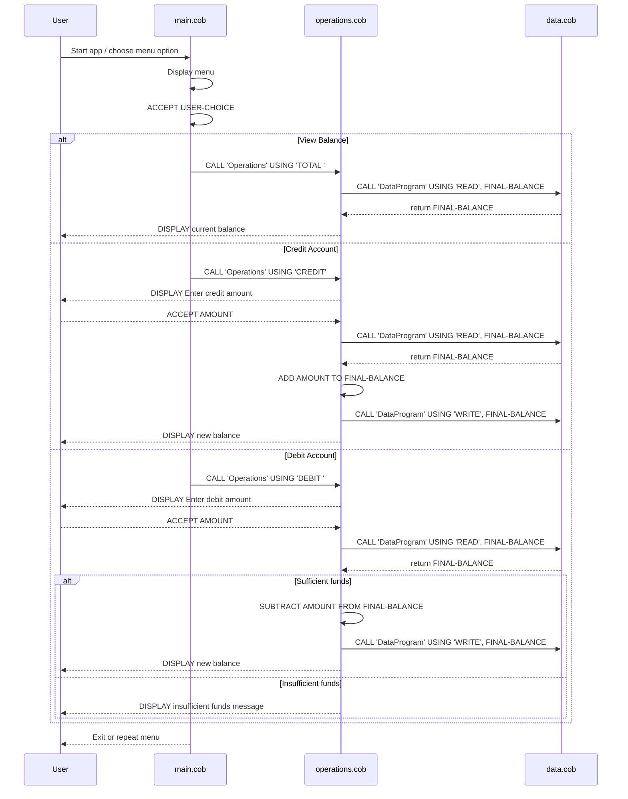

# COBOL Project Documentation

## Overview
This repository contains a simple COBOL account management system for a student account workflow. The system supports viewing the current balance, crediting the account, and debiting the account with basic validation.

## File Summary

### `src/cobol/main.cob`
- Entry point for the application.
- Displays a menu to the user with options to view balance, credit account, debit account, or exit.
- Reads the user's choice and calls `Operations` with the appropriate operation type.
- Repeats until the user selects `Exit`.

### `src/cobol/operations.cob`
- Receives the operation code from `main.cob` and performs the requested action.
- For `TOTAL`: reads the current balance from `DataProgram` and displays it.
- For `CREDIT`: prompts the user for an amount, reads the current balance, adds the credit amount, writes the new balance, and displays the updated total.
- For `DEBIT`: prompts the user for an amount, reads the current balance, checks if there are sufficient funds, subtracts the debit amount if possible, writes the new balance, and displays the updated total.
- Handles insufficient funds by displaying an error message.

### `src/cobol/data.cob`
- Acts as the data access layer for the account balance.
- Stores the account balance in working storage with an initial value of `1000.00`.
- Supports `READ` to return the current balance and `WRITE` to update the stored balance.
- This implementation uses in-memory storage only and does not persist data to disk.

## Key Functions and Flow

- `MAIN-LOGIC` in `main.cob` controls the main user menu loop.
- `Operations` in `operations.cob` decides which transaction to perform.
- `DataProgram` in `data.cob` manages the balance state.
- `CALL 'Operations' USING ...` passes the requested action from the main menu.
- `CALL 'DataProgram' USING 'READ', FINAL-BALANCE` loads the current balance.
- `CALL 'DataProgram' USING 'WRITE', FINAL-BALANCE` saves an updated balance.

## Business Rules for Student Accounts

- Starting balance is initialized to `1000.00`.
- Credit transactions increase the balance by the entered amount.
- Debit transactions only proceed when the entered amount is less than or equal to the current balance.
- If the balance is insufficient, the debit is rejected and a message is displayed.
- The menu validates input and prompts the user again for valid options if an invalid choice is entered.
- The system currently manages a single student account balance and does not include student identification, account numbers, or persistence beyond the current program execution.

## Sequence Diagram

